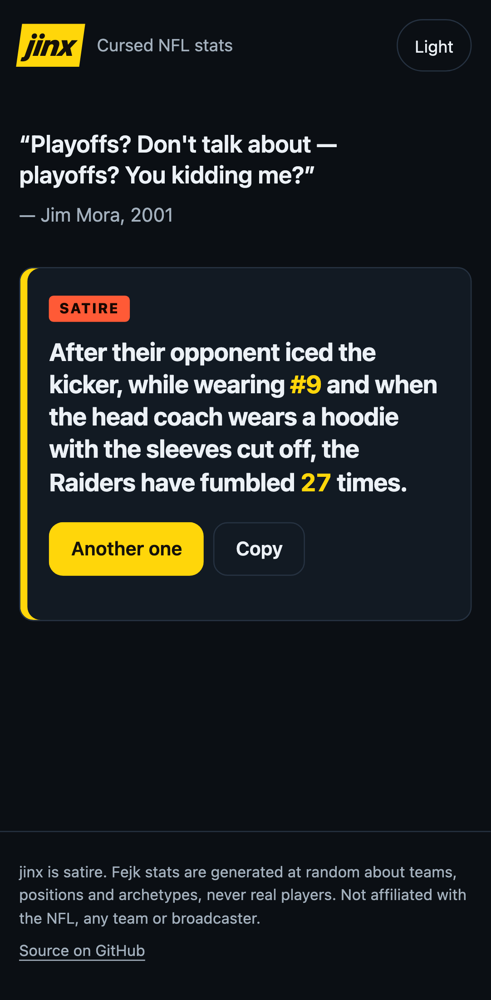

# jinx

Cursed NFL stats. A parody of the broadcast-style "insight" that is
technically true and completely useless.

> Kickers wearing #3 have missed 87% of field goals attempted during a
> halftime show with fireworks on Thursdays. **SATIRE**

**Live:** https://moudlajs.github.io/jinx/



## How it works

- **Fejk mode** combines absurd conditions, subjects and numbers from word
  banks in your browser. Every number is made up, and every card says so.
  A stat's seed is in the link, so a shared link shows the same stat.
  Copy and Share always include the satire label.
- **Real mode** shows stats from real queries over public NFL data
  (1999 to today), regenerated every week. Each card can show its
  filters, sample size and the exact SQL. See [docs/engine.md](docs/engine.md).

No accounts, no cookies, no trackers.

## Local development

```sh
cd web
npm ci
npm run dev        # http://localhost:5173/jinx/
npm test           # unit tests
npm run test:e2e   # Playwright smoke
```

See [CONTRIBUTING.md](CONTRIBUTING.md) for the PR flow.

## Data

Real-mode numbers come from [nflverse](https://github.com/nflverse)
(play-by-play, schedules and rosters), CC-BY 4.0. Thank you.

## Disclaimer

Fejk stats are satire: generated at random, about teams, positions and
archetypes, never about real players. Not affiliated with the NFL or any
team or broadcaster.

MIT licensed.
